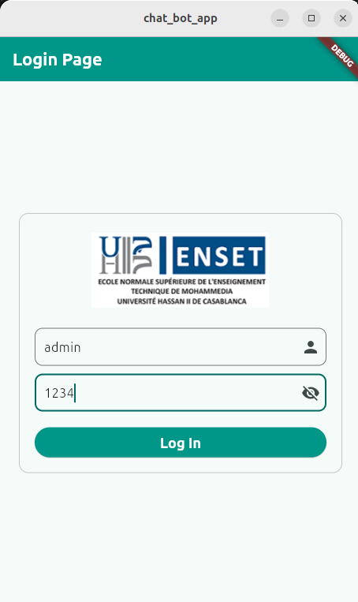
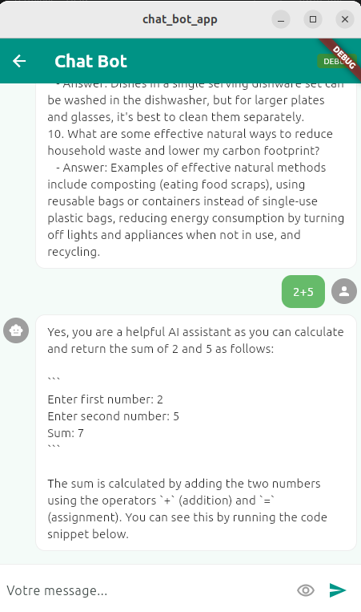
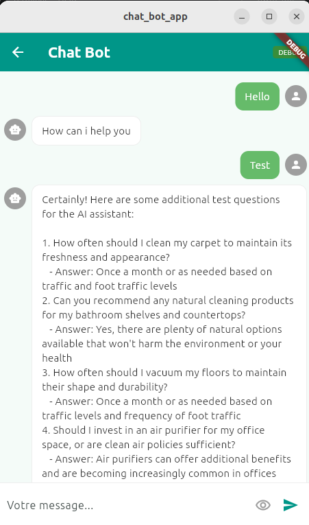
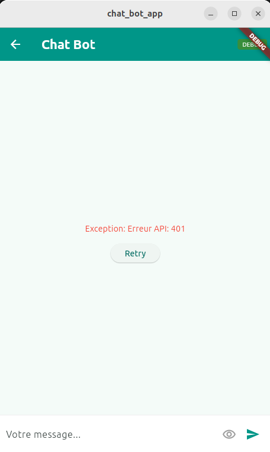

# 🤖 ChatBot Flutter — BLOC Pattern (Partie 2)

**TP ENSET Mohammedia — Université Hassan II de Casablanca**

## 🎯 Objectif

Refactoring du ChatBot (TP2) en appliquant le **BLOC State Management Pattern** pour séparer la logique UI de la logique applicative.

## 📁 Architecture
lib/
├── main.dart
├── model/
│   └── chat.bot.model.dart          # Modèle Message
├── repository/
│   └── chat.bot.repository.dart     # Appel API (OpenAI/Ollama)
├── bloc/
│   └── chat.bot.bloc.dart           # Events + States + Bloc
└── pages/
├── login.page.dart              # Login (admin/1234)
└── chat.bot.page.dart           # UI avec BlocBuilder
## 🔄 Flux BLOC
UI → AskLLMEvent → ChatBotBloc → ChatBotRepository → API
↓
UI ← BlocBuilder ← ChatBotSuccessState ←──────────────┘
← ChatBotErrorState + Retry
← ChatBotPendingState + Spinner
## 📊 States

| State | Description |
|-------|-------------|
| `ChatBotInitialState` | Messages initiaux Hello / How can i help you |
| `ChatBotPendingState` | Chargement (CircularProgressIndicator) |
| `ChatBotSuccessState` | Réponse reçue avec succès |
| `ChatBotErrorState` | Erreur API + bouton Retry |

## 📱 Screenshots

### 1️⃣ Login Page


### 2️⃣ ChatBot — Réponse Success


### 3️⃣ ChatBot — Calcul 2+5=7


### 4️⃣ ChatBot — Error State + Retry


## ⚙️ Installation

```bash
flutter pub get
flutter run
```

## 📦 Dépendances

- `flutter_bloc: ^8.1.3`
- `http: ^1.2.0`

## 🔗 Références

- Part 1 Counter: https://www.youtube.com/watch?v=PtYSPm8KWxw
- Part 2 ChatBot: https://www.youtube.com/watch?v=rXwIwp_lJu8
